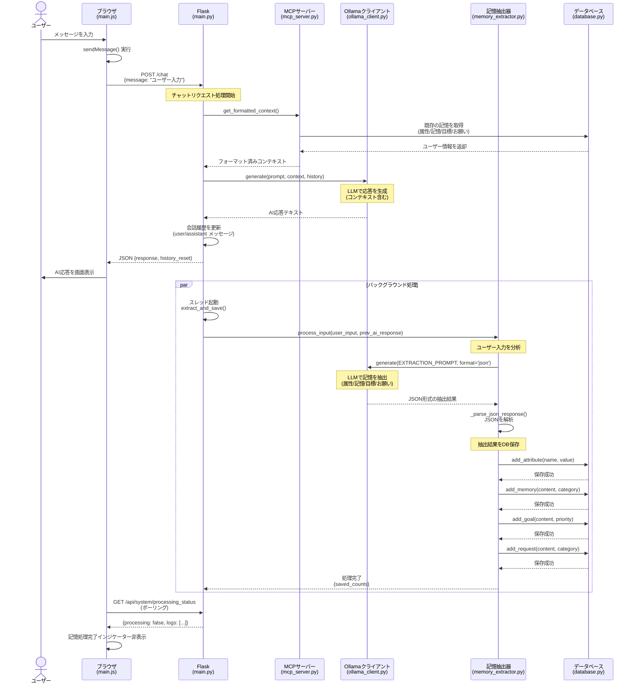

# ユーザー入力からDB登録までのシーケンス図

## 概要

このシーケンス図は、ユーザーがチャット画面でメッセージを入力してから、そのメッセージから抽出された情報がデータベースに登録されるまでの一連の流れを示しています。

## シーケンス図

## フローの詳細説明

### 1. ユーザー入力フェーズ
- **ユーザー**: チャット画面でメッセージを入力し、送信ボタンをクリック
- **ブラウザ**: `sendMessage()` 関数が実行され、`/chat` エンドポイントにPOSTリクエストを送信
- **関連コード**: `static/js/main.js:141-168`

### 2. コンテキスト取得フェーズ
- **Flask**: リクエストを受信し、MCPサーバーからユーザーのコンテキスト（既存の記憶）を取得
- **MCPサーバー**: データベースから既存のユーザー情報（属性、記憶、目標、お願い）を取得し、フォーマット
- **関連コード**: `app/main.py:203-211`, `app/mcp_server.py`

### 3. AI応答生成フェーズ
- **Ollamaクライアント**: ユーザー入力、コンテキスト、会話履歴を使ってLLMで応答を生成
- **関連コード**: `app/main.py:222-227`, `app/ollama_client.py`

### 4. 履歴更新と応答返却
- **Flask**: 会話履歴を更新し、ユーザーにAIの応答を返却
- **ブラウザ**: 受信したAI応答を画面に表示
- **関連コード**: `app/main.py:237-273`, `static/js/main.js:170-206`

### 5. バックグラウンド記憶抽出フェーズ（非同期）
- **Flask**: バックグラウンドスレッドで記憶抽出処理を開始
- **記憶抽出器**: ユーザー入力をLLMで分析し、保存すべき情報（属性、記憶、目標、お願い）をJSON形式で抽出
- **関連コード**: `app/main.py:245-259`, `app/memory_extractor.py:120-176`

### 6. DB保存フェーズ
- **記憶抽出器**: 抽出された情報をカテゴリごとにデータベースに保存
  - **属性** (attributes): 名前、年齢、職業など
  - **記憶** (memories): 日常の出来事、好みなど
  - **目標** (goals): やりたいこと、達成したいことなど
  - **お願い** (requests): アシスタントへの要望（話し方など）
- **関連コード**: `app/memory_extractor.py:217-267`, `app/database.py`

### 7. ステータス確認（フロントエンド）
- **ブラウザ**: 定期的に `/api/system/processing_status` をポーリングして処理状況を確認
- **完了時**: 記憶処理完了インジケーターを非表示にする
- **関連コード**: `static/js/main.js:485-528`, `app/main.py:493-509`

## 主要な特徴

1. **非同期処理**: 記憶抽出はバックグラウンドで実行されるため、ユーザーはAI応答を待つ必要がありません
2. **LLMベースの抽出**: 自然言語処理により、ユーザーの発言から自動的に重要な情報を抽出します
3. **カテゴリ分類**: 抽出された情報は適切なカテゴリ（属性/記憶/目標/お願い）に自動分類されます
4. **リアルタイムフィードバック**: テストモードでは、抽出プロセスのログをリアルタイムで確認できます

## 関連ファイル

- **フロントエンド**: `static/js/main.js`
- **バックエンド**: `app/main.py`
- **記憶抽出**: `app/memory_extractor.py`
- **データベース**: `app/database.py`
- **MCP**: `app/mcp_server.py`
- **Ollama**: `app/ollama_client.py`
